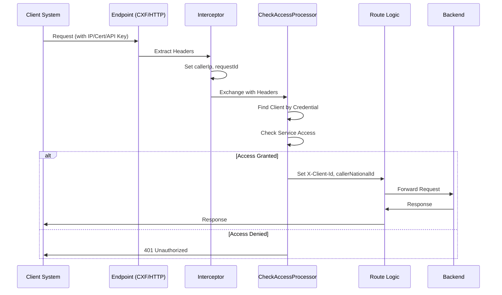
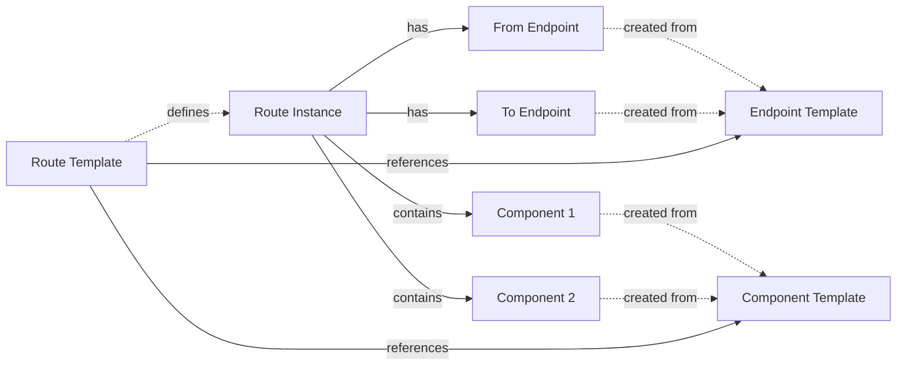
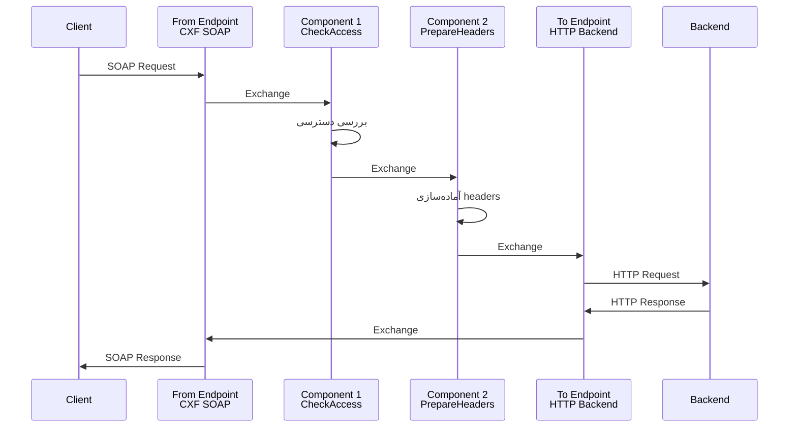

# Apache Camel Concepts for ESM System

## Document Information

**Project**: BITA - Next-Generation Enterprise Service Gateway  
**Version**: 4.0  
**Date**: February 11, 2026  
**Purpose**: Apache Camel concepts explanation for LLM and developers

---

## 1. Apache Camel چیست؟

Apache Camel یک فریمورک integration قدرتمند است که:
- بر اساس **Enterprise Integration Patterns (EIP)** طراحی شده
- **Route-based message processing** را فراهم می‌کند
- از بیش از 300 component و protocol پشتیبانی می‌کند
- به صورت **declarative** جریان داده را تعریف می‌کند

### معماری کلی

```
┌─────────────┐      ┌──────────────┐      ┌─────────────┐
│  Endpoint   │ ───> │   Route      │ ───> │  Endpoint   │
│  (ورودی)    │      │  (پردازش)    │      │  (خروجی)    │
└─────────────┘      └──────────────┘      └─────────────┘
                            │
                            ▼
                     ┌──────────────┐
                     │ Components   │
                     │ (پردازشگرها) │
                     └──────────────┘
```

---

## 2. Endpoint (نقطه پایانی)

### 2.1 تعریف

**Endpoint** نقطه ورودی یا خروجی یک route است. endpoint ها مشخص می‌کنند:
- داده از کجا می‌آید (consumer endpoint)
- داده به کجا می‌رود (producer endpoint)

### 2.2 انواع Endpoint ها

#### CXF Endpoint (SOAP Services)
برای سرویس‌های SOAP با پشتیبانی از WS-Security

**URI Pattern:**
```
cxf:bean:{{serviceName}}?wsdlURL={{wsdlUrl}}&dataFormat={{dataFormat}}
```

**مثال:**
```
cxf:bean:paymentService?wsdlURL=file:///tmp/payment.wsdl&dataFormat=PAYLOAD
```

**پارامترهای رایج:**
- `wsdlURL`: آدرس فایل WSDL
- `dataFormat`: PAYLOAD یا MESSAGE
- `serviceClass`: کلاس interface سرویس
- `username`, `password`: برای basic auth

#### HTTP Endpoint (REST APIs)
برای فراخوانی REST API ها

**URI Pattern:**
```
http://{{host}}:{{port}}/{{path}}
```

**مثال:**
```
http://payment-backend:8080/api/v1/payment
```

**پارامترهای رایج:**
- `httpMethod`: GET, POST, PUT, DELETE
- `authMethod`: Basic, Bearer
- `connectTimeout`: timeout اتصال
- `socketTimeout`: timeout socket

#### Platform HTTP Endpoint
برای دریافت درخواست HTTP در Camel K

**URI Pattern:**
```
platform-http:/{{path}}
```

**مثال:**
```
platform-http:/api/payment
```

#### Direct Endpoint
برای ارتباط داخلی بین route ها (synchronous)

**URI Pattern:**
```
direct:{{channelName}}
```

**مثال:**
```
direct:paymentInput
```

#### SEDA Endpoint
برای پردازش asynchronous با queue

**URI Pattern:**
```
seda:{{queueName}}?concurrentConsumers={{consumers}}
```

**مثال:**
```
seda:logChannel?concurrentConsumers=5
```

### 2.3 Endpoint Template

**هدف:** ایجاد الگوی قابل استفاده مجدد برای endpoint ها

**پارامترهای مورد نیاز:**

| پارامتر | نوع | الزامی | توضیح |
|---------|-----|--------|-------|
| name | string | ✅ | نام قالب (فقط a-z, 0-9, -) |
| uriPattern | string | ✅ | الگوی URI با {{placeholder}} |
| category | string | ❌ | دسته‌بندی (soap, rest, file) |
| description | string | ❌ | توضیحات قالب |
| configSchema | object | ❌ | JSON Schema پارامترها |
| defaultRateLimit | integer | ❌ | محدودیت نرخ پیش‌فرض |

**مثال کامل:**
```json
{
  "name": "basic-auth-soap",
  "description": "SOAP endpoint with basic authentication",
  "uriPattern": "cxf:bean:{{serviceName}}?wsdlURL={{wsdlUrl}}&username={{username}}&password={{password}}",
  "category": "soap",
  "configSchema": {
    "type": "object",
    "properties": {
      "serviceName": {
        "type": "string",
        "description": "نام bean سرویس در Spring context"
      },
      "wsdlUrl": {
        "type": "string",
        "description": "آدرس فایل WSDL (file:// یا http://)"
      },
      "username": {
        "type": "string",
        "description": "نام کاربری برای basic auth"
      },
      "password": {
        "type": "string",
        "description": "رمز عبور"
      }
    },
    "required": ["serviceName", "wsdlUrl", "username", "password"]
  },
  "defaultRateLimit": 100
}
```

### 2.4 Endpoint Instance

**هدف:** ساخت یک endpoint خاص از template با مقادیر مشخص

**مثال:**
```json
{
  "templateId": 15,
  "name": "payment-soap-endpoint",
  "description": "Endpoint for payment service",
  "config": {
    "serviceName": "paymentService",
    "wsdlUrl": "file:///tmp/payment.wsdl",
    "username": "esm_user",
    "password": "secure_password"
  },
  "defaultRateLimit": 50
}
```

**نتیجه:** URI نهایی
```
cxf:bean:paymentService?wsdlURL=file:///tmp/payment.wsdl&username=esm_user&password=secure_password
```

---

## 3. Component (جزء پردازشگر)

### 3.1 تعریف

**Component** واحدهای پردازشی هستند که در میانه route قرار می‌گیرند و:
- داده را تبدیل می‌کنند (transformation)
- اعتبارسنجی انجام می‌دهند (validation)
- منطق کسب‌وکار را اجرا می‌کنند (business logic)
- دسترسی را بررسی می‌کنند (access control)

### 3.2 انواع Component

#### PROCESSOR
کلاس‌هایی که interface `org.apache.camel.Processor` را implement می‌کنند

**Interface:**
```java
public interface Processor {
    void process(Exchange exchange) throws Exception;
}
```

**مثال:**
```java
@Component
public class CheckAccessProcessor implements Processor {
    @Override
    public void process(Exchange exchange) throws Exception {
        String callerIp = exchange.getIn().getHeader("callerIp", String.class);
        String serviceId = exchange.getIn().getHeader("serviceId", String.class);
        
        // بررسی دسترسی
        if (!hasAccess(callerIp, serviceId)) {
            throw new UnauthorizedException("Access denied");
        }
    }
}
```

**استفاده در Route:**
```java
from("cxf:bean:service")
  .process(new CheckAccessProcessor())  // یا .bean(CheckAccessProcessor.class)
  .to("http://backend");
```

#### BEAN
هر Spring bean که متد عمومی دارد

**مثال:**
```java
@Service
public class TransformationService {
    public String transform(String input) {
        // تبدیل داده
        return processedData;
    }
}
```

**استفاده در Route:**
```java
from("direct:input")
  .bean("transformationService", "transform")
  .to("direct:output");
```

### 3.3 تفاوت Component و Interceptor

**مهم:** Component ها با Interceptor ها متفاوت هستند!

| Component | Interceptor |
|-----------|-------------|
| در route قرار می‌گیرد | در endpoint قرار می‌گیرد |
| داده را پردازش می‌کند | SOAP message را intercept می‌کند |
| مثال: CheckAccessProcessor | مثال: WSS4JInInterceptor |
| با `.process()` یا `.bean()` | با `endpoint.getInInterceptors().add()` |

**Interceptor ها** (مثل WSS4J) به عنوان **فایل‌های ضمیمه** به endpoint یا route اضافه می‌شوند، نه به عنوان component template.

### 3.4 Component Template

**پارامترهای مورد نیاز:**

| پارامتر | نوع | الزامی | توضیح |
|---------|-----|--------|-------|
| name | string | ✅ | نام قالب (فقط a-z, 0-9, -) |
| componentType | enum | ✅ | PROCESSOR یا BEAN |
| className | string | ✅ | نام کامل کلاس Java |
| category | string | ❌ | دسته‌بندی (security, transformation, logging) |
| description | string | ❌ | توضیحات |
| configSchema | object | ❌ | JSON Schema پارامترها |

**مثال کامل:**
```json
{
  "name": "access-checker",
  "description": "Checks client access permissions",
  "componentType": "PROCESSOR",
  "className": "ir.bita.esm.processor.CheckAccessProcessor",
  "category": "security",
  "configSchema": {
    "type": "object",
    "properties": {
      "strictMode": {
        "type": "boolean",
        "default": true,
        "description": "حالت سخت‌گیرانه - در صورت شک دسترسی را رد کند"
      },
      "allowedIps": {
        "type": "array",
        "items": {"type": "string"},
        "description": "لیست IP های مجاز (اختیاری)"
      },
      "cacheTimeout": {
        "type": "integer",
        "default": 300,
        "description": "مدت زمان cache نتایج (ثانیه)"
      }
    }
  }
}
```

### 3.5 Component Instance

**مثال:**
```json
{
  "templateId": 3,
  "routeId": 25,
  "name": "payment-access-checker",
  "config": {
    "strictMode": true,
    "allowedIps": ["192.168.1.0/24"],
    "cacheTimeout": 600
  },
  "orderIndex": 1
}
```

---

## 4. Route (مسیر)

### 4.1 تعریف

**Route** جریان کامل پردازش یک درخواست را تعریف می‌کند:

```
Endpoint ورودی → Component 1 → Component 2 → ... → Endpoint خروجی
```

### 4.2 ساختار Route

یک route معمولی شامل:

1. **From Endpoint** - نقطه شروع (consumer)
2. **Processing Steps** - component ها و logic ها
3. **To Endpoint** - نقطه پایان (producer)

**مثال ساده:**
```java
from("cxf:bean:paymentService")
  .to("http://backend:8080/payment");
```

**مثال پیچیده با احراز هویت:**
```java
from("cxf:bean:paymentService")
  .routeId("payment-route")
  .process(new PrepareHeadersProcessor())
  .process(new CheckAccessProcessor())  // بررسی دسترسی کلاینت
  .choice()
    .when(header("ownerDomain").isEqualTo("local"))
      .to("direct:localPayment")
    .otherwise()
      .to("activemq:queue:remotePayment")
  .end()
  .process(new PrepareResultProcessor())
  .to("seda:logChannel");
```

### 4.2.1 دسترسی به اطلاعات Client در Route

**مهم:** در route ها می‌توان به اطلاعات **Client** (سازمان) و **Credential** های آن‌ها دسترسی داشت.

**Headers موجود در Exchange:**
- `callerIp`: IP فراخواننده (از درخواست HTTP)
- `callerNationalId`: شناسه ملی سازمان فراخواننده
- `callerOrganization`: نام سازمان فراخواننده
- `X-Client-Id`: شناسه کلاینت (بعد از احراز هویت)
- `serviceName`: نام سرویس
- `version`: نسخه سرویس
- `requestId`: شناسه یکتای درخواست

**نحوه استفاده در Component ها:**
```java
@Component
public class CheckAccessProcessor implements Processor {
    @Override
    public void process(Exchange exchange) throws Exception {
        Message message = exchange.getIn();
        
        // دریافت IP فراخواننده
        String callerIp = message.getHeader("callerIp", String.class);
        
        // پیدا کردن Client بر اساس IP
        Client client = clientRepository.findByCredentialIp(callerIp);
        
        if (client == null) {
            throw new UnauthorizedException("IP not recognized: " + callerIp);
        }
        
        // بررسی دسترسی به سرویس
        String serviceName = message.getHeader("serviceName", String.class);
        boolean hasAccess = accessService.checkAccess(client.getId(), serviceName);
        
        if (!hasAccess) {
            throw new UnauthorizedException("Client does not have access");
        }
        
        // تنظیم اطلاعات کلاینت در header
        message.setHeader("X-Client-Id", client.getId());
        message.setHeader("callerNationalId", client.getNationalId());
        message.setHeader("callerOrganization", client.getDisplayName());
    }
}
```

**انواع Credential برای احراز هویت:**
1. **IP_ADDRESS**: بررسی IP فراخواننده
2. **X509_CERTIFICATE**: احراز هویت با گواهی دیجیتال
3. **API_KEY**: کلید API در header
4. **OAUTH2**: توکن OAuth2
5. **BASIC_AUTH**: نام کاربری و رمز عبور

### 4.3 Route Instance

**هدف:** ساخت یک route خاص برای یک سرویس

**پارامترهای مورد نیاز:**

| پارامتر | نوع | الزامی | توضیح |
|---------|-----|--------|-------|
| serviceId | integer | ✅ | شناسه سرویس که route به آن تعلق دارد |
| name | string | ✅ | نام route (فقط a-z, 0-9, -) |
| fromUri | string | ✅ | URI endpoint ورودی |
| toUri | string | ✅ | URI endpoint خروجی |
| description | string | ❌ | توضیحات route |
| active | boolean | ❌ | وضعیت فعال/غیرفعال (default: true) |

**مثال کامل:**
```json
{
  "serviceId": 10,
  "name": "payment-soap-route",
  "description": "Route for payment SOAP service",
  "fromUri": "cxf:bean:paymentService?wsdlURL=file:///tmp/payment.wsdl",
  "toUri": "http://payment-backend:8080/api/v1/payment"
}
```

**نتیجه:** route زیر ساخته می‌شود:
```java
from("cxf:bean:paymentService?wsdlURL=file:///tmp/payment.wsdl")
  .routeId("payment-soap-route")
  .to("http://payment-backend:8080/api/v1/payment");
```

### 4.4 Route Template

**هدف:** ایجاد الگوی قابل استفاده مجدد برای route ها

**پارامترهای مورد نیاز:**

| پارامتر | نوع | الزامی | توضیح |
|---------|-----|--------|-------|
| name | string | ✅ | نام قالب (فقط a-z, 0-9, -) |
| fromEndpointTemplateId | integer | ❌ | شناسه قالب endpoint ورودی |
| toEndpointTemplateId | integer | ❌ | شناسه قالب endpoint خروجی |
| category | string | ❌ | دسته‌بندی (transformation, proxy, security) |
| description | string | ❌ | توضیحات |
| configSchema | object | ❌ | JSON Schema پارامترهای قابل تنظیم |
| componentConfig | object | ❌ | پیکربندی component های میانی |

**مثال کامل:**
```json
{
  "name": "soap-to-rest-with-auth",
  "description": "SOAP to REST route with access checking",
  "fromEndpointTemplateId": 5,
  "toEndpointTemplateId": 8,
  "category": "transformation",
  "componentConfig": {
    "processors": [
      {
        "templateId": 3,
        "order": 1,
        "config": {"strictMode": true}
      },
      {
        "templateId": 4,
        "order": 2,
        "config": {"logLevel": "INFO"}
      }
    ]
  },
  "configSchema": {
    "type": "object",
    "properties": {
      "timeout": {
        "type": "integer",
        "default": 30000,
        "description": "Timeout به میلی‌ثانیه"
      },
      "retryCount": {
        "type": "integer",
        "default": 3,
        "description": "تعداد تلاش مجدد"
      }
    }
  }
}
```

---

## 5. Client Authentication and Authorization in Routes

### 5.1 نقش Client در Route ها

در سیستم ESM، هر درخواست به route ها باید از یک **Client** (سازمان) معتبر بیاید. Route ها با استفاده از **Credential** های Client، احراز هویت و کنترل دسترسی انجام می‌دهند.

### 5.2 جریان احراز هویت



### 5.3 انواع Credential و نحوه استفاده

#### 5.3.1 IP_ADDRESS

**کاربرد:** سیستم‌های داخلی با IP ثابت

**پیکربندی:**
```json
{
  "clientId": 10,
  "credentialType": "IP_ADDRESS",
  "data": {
    "addresses": ["192.168.1.100", "10.0.0.0/24"]
  },
  "validFrom": "2026-01-01T00:00:00",
  "validUntil": "2027-01-01T00:00:00"
}
```

**بررسی در Route:**
```java
String callerIp = exchange.getIn().getHeader("callerIp", String.class);
Client client = clientRepository.findByCredentialIp(callerIp);
```

#### 5.3.2 X509_CERTIFICATE

**کاربرد:** سیستم‌های با امنیت بالا (بانک‌ها، سازمان‌های دولتی)

**پیکربندی:**
```json
{
  "clientId": 10,
  "credentialType": "X509_CERTIFICATE",
  "data": {
    "certificate": "-----BEGIN CERTIFICATE-----\n...",
    "alias": "bank-melli",
    "serialNumber": "1234567890"
  }
}
```

**بررسی در Route:**
```java
X509Certificate cert = (X509Certificate) exchange.getIn()
    .getHeader("X-Client-Certificate");
Client client = clientRepository.findByCertificateSerial(
    cert.getSerialNumber().toString()
);
```

#### 5.3.3 API_KEY

**کاربرد:** سیستم‌های خارجی با REST API

**پیکربندی:**
```json
{
  "clientId": 10,
  "credentialType": "API_KEY",
  "data": {
    "key": "esm_live_abc123...",
    "secret": "sk_live_xyz789..."
  }
}
```

**بررسی در Route:**
```java
String apiKey = exchange.getIn().getHeader("X-API-Key", String.class);
Client client = clientRepository.findByApiKey(apiKey);
```

#### 5.3.4 BASIC_AUTH

**کاربرد:** سیستم‌های legacy با username/password

**پیکربندی:**
```json
{
  "clientId": 10,
  "credentialType": "BASIC_AUTH",
  "data": {
    "username": "client_user",
    "passwordHash": "$2a$10$..."
  }
}
```

**بررسی در Route:**
```java
String authHeader = exchange.getIn().getHeader("Authorization", String.class);
// Parse Basic Auth
Client client = clientRepository.findByUsername(username);
```

### 5.4 CheckAccessProcessor - مثال کامل

```java
@Component
public class CheckAccessProcessor implements Processor {
    
    @Autowired
    private ClientRepository clientRepository;
    
    @Autowired
    private ServiceAccessRepository accessRepository;
    
    @Override
    public void process(Exchange exchange) throws Exception {
        Message message = exchange.getIn();
        
        // 1. Extract caller information
        String callerIp = message.getHeader("callerIp", String.class);
        String serviceName = message.getHeader("serviceName", String.class);
        
        if (callerIp == null || serviceName == null) {
            throw new IllegalArgumentException("Missing required headers");
        }
        
        // 2. Find client by IP credential
        Optional<Client> clientOpt = clientRepository
            .findByCredentialIp(callerIp);
        
        if (clientOpt.isEmpty()) {
            logUnauthorizedAccess(callerIp, serviceName, "IP not recognized");
            throw new UnauthorizedException(
                "Caller IP not recognized: " + callerIp
            );
        }
        
        Client client = clientOpt.get();
        
        // 3. Check if client is active
        if (!client.isActive()) {
            throw new UnauthorizedException("Client is not active");
        }
        
        // 4. Check service access
        boolean hasAccess = accessRepository
            .existsByClientIdAndServiceName(client.getId(), serviceName);
        
        if (!hasAccess) {
            logUnauthorizedAccess(callerIp, serviceName, 
                "Client does not have access");
            throw new UnauthorizedException(
                "Client " + client.getName() + 
                " does not have access to " + serviceName
            );
        }
        
        // 5. Set client information in headers for downstream processing
        message.setHeader("X-Client-Id", client.getId());
        message.setHeader("callerNationalId", 
            client.getTags().get("national_id"));
        message.setHeader("callerOrganization", client.getDisplayName());
        
        // Log successful access
        logSuccessfulAccess(client, serviceName);
    }
    
    private void logUnauthorizedAccess(String ip, String service, String reason) {
        log.warn("Unauthorized access attempt - IP: {}, Service: {}, Reason: {}", 
            ip, service, reason);
        // Send to InfluxDB for monitoring
    }
    
    private void logSuccessfulAccess(Client client, String service) {
        log.info("Access granted - Client: {}, Service: {}", 
            client.getName(), service);
    }
}
```

### 5.5 استفاده از Client Information در Component های دیگر

بعد از اینکه `CheckAccessProcessor` اطلاعات کلاینت را تنظیم کرد، component های بعدی می‌توانند از آن استفاده کنند:

```java
@Component
public class PrepareHeadersProcessor implements Processor {
    @Override
    public void process(Exchange exchange) throws Exception {
        Message message = exchange.getIn();
        
        // دریافت اطلاعات کلاینت
        Long clientId = message.getHeader("X-Client-Id", Long.class);
        String nationalId = message.getHeader("callerNationalId", String.class);
        
        // اضافه کردن به SOAP header برای backend
        message.setHeader("X-Caller-National-Id", nationalId);
        message.setHeader("X-Caller-Client-Id", clientId);
        message.setHeader("X-Request-Time", System.currentTimeMillis());
    }
}
```

### 5.6 نکات مهم

1. **Credential Caching**: برای بهبود performance، credential ها باید cache شوند
2. **Credential Expiration**: همیشه `validFrom` و `validUntil` را بررسی کنید
3. **Multiple Credentials**: یک Client می‌تواند چند credential داشته باشد (مثلاً IP + Certificate)
4. **Credential Priority**: در صورت وجود چند credential، اولویت‌بندی کنید
5. **Audit Logging**: تمام تلاش‌های احراز هویت (موفق و ناموفق) باید log شوند

---

## 6. رابطه بین مفاهیم

### 6.1 نمودار ارتباط



### 6.2 جریان داده در یک Route



### 6.3 مثال کامل

**سناریو:** ساخت یک route برای سرویس پرداخت که:
1. درخواست SOAP دریافت می‌کند
2. دسترسی را بررسی می‌کند
3. به REST API backend متصل می‌شود

**گام 1: ساخت Endpoint Template برای SOAP**
```json
{
  "action": "endpoint_template",
  "params": {
    "name": "soap-cxf-endpoint",
    "uriPattern": "cxf:bean:{{serviceName}}?wsdlURL={{wsdlUrl}}",
    "category": "soap",
    "configSchema": {
      "type": "object",
      "properties": {
        "serviceName": {"type": "string"},
        "wsdlUrl": {"type": "string"}
      },
      "required": ["serviceName", "wsdlUrl"]
    }
  }
}
```

**گام 2: ساخت Endpoint Template برای HTTP**
```json
{
  "action": "endpoint_template",
  "params": {
    "name": "http-rest-endpoint",
    "uriPattern": "http://{{host}}:{{port}}/{{path}}",
    "category": "rest",
    "configSchema": {
      "type": "object",
      "properties": {
        "host": {"type": "string"},
        "port": {"type": "integer"},
        "path": {"type": "string"}
      },
      "required": ["host", "port", "path"]
    }
  }
}
```

**گام 3: ساخت Component Template**
```json
{
  "action": "component_template",
  "params": {
    "name": "access-checker",
    "componentType": "PROCESSOR",
    "className": "ir.bita.esm.processor.CheckAccessProcessor",
    "category": "security"
  }
}
```

**گام 4: ساخت Route**
```json
{
  "action": "route_instance",
  "params": {
    "serviceId": 10,
    "name": "payment-route",
    "description": "Payment service route",
    "fromUri": "cxf:bean:paymentService?wsdlURL=file:///tmp/payment.wsdl",
    "toUri": "http://payment-backend:8080/api/v1/payment"
  }
}
```

---

## 7. Template vs Instance

### 7.1 تفاوت اصلی

| جنبه | Template (قالب) | Instance (نمونه) |
|------|-----------------|------------------|
| **هدف** | الگوی قابل استفاده مجدد | مورد خاص با مقادیر مشخص |
| **پارامترها** | placeholder ها ({{name}}) | مقادیر واقعی |
| **استفاده** | برای ساخت instance های متعدد | برای اجرا در runtime |
| **مثال** | `http://{{host}}/{{path}}` | `http://backend:8080/api/payment` |

### 7.2 چه زمانی از کدام استفاده کنیم؟

**Template بساز وقتی:**
- می‌خواهی یک الگو برای استفاده‌های مکرر داشته باشی
- پارامترها در موارد مختلف تغییر می‌کنند
- می‌خواهی استانداردسازی کنی

**Instance بساز وقتی:**
- می‌خواهی یک endpoint/route خاص برای یک سرویس بسازی
- مقادیر پارامترها مشخص هستند
- آماده اجرا در production است

### 7.3 مثال کاربردی

**Template:**
```json
{
  "name": "soap-endpoint-template",
  "uriPattern": "cxf:bean:{{serviceName}}?wsdlURL={{wsdlUrl}}"
}
```

**Instance 1:**
```json
{
  "templateId": 5,
  "name": "payment-soap",
  "config": {
    "serviceName": "paymentService",
    "wsdlUrl": "file:///tmp/payment.wsdl"
  }
}
```

**Instance 2:**
```json
{
  "templateId": 5,
  "name": "user-soap",
  "config": {
    "serviceName": "userService",
    "wsdlUrl": "file:///tmp/user.wsdl"
  }
}
```

---

## 8. URI Pattern Examples

### SOAP Services (CXF)

**Basic:**
```
cxf:bean:{{serviceName}}?wsdlURL={{wsdlUrl}}
```

**With Authentication:**
```
cxf:bean:{{serviceName}}?wsdlURL={{wsdlUrl}}&username={{username}}&password={{password}}
```

**With Data Format:**
```
cxf:bean:{{serviceName}}?wsdlURL={{wsdlUrl}}&dataFormat={{dataFormat}}
```

### REST Services (HTTP)

**Basic:**
```
http://{{host}}:{{port}}/{{path}}
```

**With Method:**
```
http://{{host}}:{{port}}/{{path}}?httpMethod={{method}}
```

**With Timeout:**
```
http://{{host}}:{{port}}/{{path}}?connectTimeout={{timeout}}&socketTimeout={{timeout}}
```

### Internal Communication

**Direct (Synchronous):**
```
direct:{{channelName}}
```

**SEDA (Asynchronous):**
```
seda:{{queueName}}?concurrentConsumers={{consumers}}
```

---

## 9. نکات مهم برای LLM

### 9.1 هنگام ساخت Endpoint Template

1. **URI Pattern** باید شامل placeholder ها باشد: `{{paramName}}`
2. **configSchema** باید JSON Schema معتبر باشد
3. **category** به گروه‌بندی کمک می‌کند: soap, rest, file, messaging
4. **نام** فقط حروف کوچک انگلیسی، اعداد و dash

### 9.2 هنگام ساخت Component Template

1. **className** باید نام کامل کلاس Java باشد
2. **componentType** فقط PROCESSOR یا BEAN
3. Interceptor ها component نیستند
4. Component ها باید در classpath موجود باشند

### 9.3 هنگام ساخت Route

1. **fromUri** و **toUri** باید URI های معتبر Camel باشند
2. می‌توان از endpoint template استفاده کرد یا URI مستقیم
3. route به یک service تعلق دارد (serviceId الزامی)
4. component ها به صورت خودکار در route قرار می‌گیرند

### 9.5 استاندارد Auth و Host برای LLM

1. احراز هویت Caller در BITA باید credential-based باشد (IP_ADDRESS, X509_CERTIFICATE, API_KEY, OAUTH2, BASIC_AUTH)
2. محل احراز هویت، route/component است (مثل `CheckAccessProcessor`) نه اجبار قراردادن `username/password` در هر HTTP endpoint template
3. مقدار `host` در endpoint instance یعنی **مقصد downstream**:
   - سرویس داخلی در Kubernetes: نام DNS سرویس (مثل `payment-1-0-esb-svc` یا `esm-backend`)
   - سرویس خارجی: دامنه واقعی مقصد (مثل `api.bank.ir`)
4. `0.0.0.0` یا `localhost` معمولاً برای bind کردن سرور است، نه مقصد call خروجی route
5. اگر `host` نامشخص بود:
   - ابتدا `request_data` برای کشف سرویس داخلی
   - در غیر این صورت `ask_question` برای `host/port/path`
6. برای نمایش URL قابل فراخوانی به کاربر:
   - TEST: `https://{gateway-host}/test{basePath}/{version}/{routePath}`
   - ACTIVE: `https://{gateway-host}{basePath}/{version}/{routePath}`

### 9.4 Validation

**نام‌ها:**
- فقط `[a-z0-9-]`
- مثال صحیح: `basic-auth-soap`, `payment-route-v1`
- مثال غلط: `Basic Auth SOAP`, `مسیر_پرداخت`

**URI Pattern:**
- باید با protocol شروع شود: `cxf:`, `http:`, `direct:`, `seda:`
- placeholder ها با `{{}}` مشخص می‌شوند
- پارامترها با `?` و `&` جدا می‌شوند

---

## 10. خلاصه پارامترها

### Endpoint Template
```
✅ name (string, required)
✅ uriPattern (string, required)
❌ category (string)
❌ description (string)
❌ configSchema (object)
❌ defaultRateLimit (integer)
```

### Component Template
```
✅ name (string, required)
✅ componentType (enum: PROCESSOR|BEAN, required)
✅ className (string, required)
❌ category (string)
❌ description (string)
❌ configSchema (object)
```

### Route Template
```
✅ name (string, required)
❌ fromEndpointTemplateId (integer)
❌ toEndpointTemplateId (integer)
❌ category (string)
❌ description (string)
❌ configSchema (object)
❌ componentConfig (object)
```

### Route Instance
```
✅ serviceId (integer, required)
✅ name (string, required)
✅ fromUri (string, required)
✅ toUri (string, required)
❌ description (string)
❌ active (boolean)
```

---

## 11. سناریوهای رایج

### سناریو 1: SOAP to REST
```
SOAP Request → CXF Endpoint → CheckAccess → Transform → HTTP Endpoint → REST API
```

### سناریو 2: REST to SOAP
```
HTTP Request → Platform-HTTP → Validate → Transform → CXF Endpoint → SOAP Service
```

### سناریو 3: Message Queue
```
SOAP Request → CXF → CheckAccess → ActiveMQ Queue → Remote ESB → Backend
```

### سناریو 4: Async Logging
```
Main Route → Process → WireTap → SEDA Queue → Async Logger → InfluxDB
```

---

## 12. مراجع

- Apache Camel Documentation: https://camel.apache.org/
- Enterprise Integration Patterns: https://www.enterpriseintegrationpatterns.com/
- CXF Component: https://camel.apache.org/components/latest/cxf-component.html
- HTTP Component: https://camel.apache.org/components/latest/http-component.html
